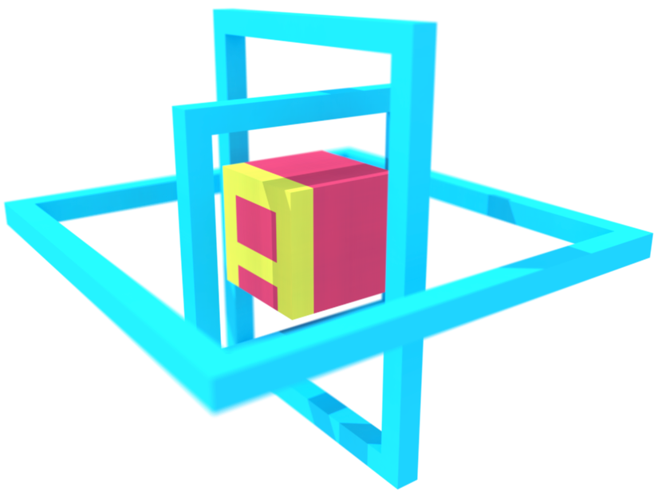
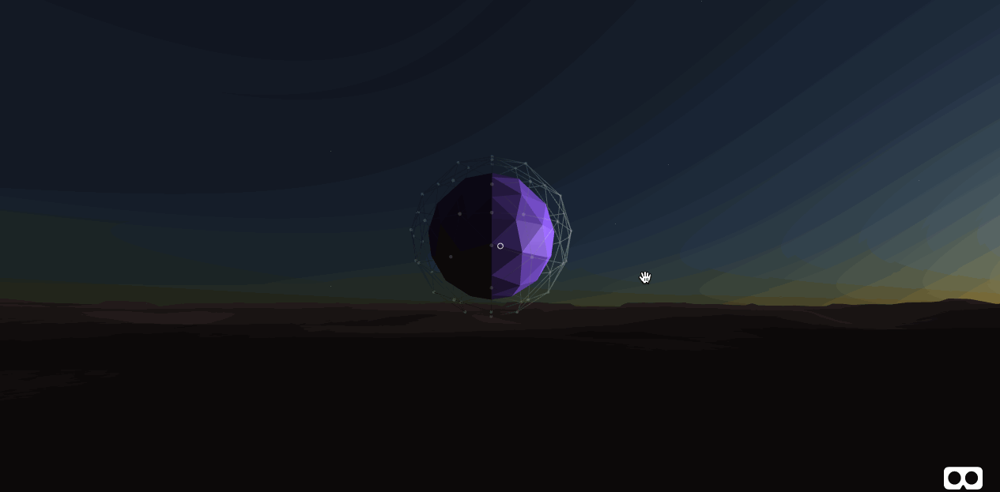

<h1 align="center">Sphere changing color</h1>

 

  

<h5 align="center">
  WEBVR Project built in react
</h5>

## Getting Started

This project was made utilizing A-framework built in with three.js and also webgl for 3d rendering physics. 
Introductions of this project will be produced via youtube and explain some of the core concepts of utilizing 
geometrical syntax and environment as well. Enjoy!

